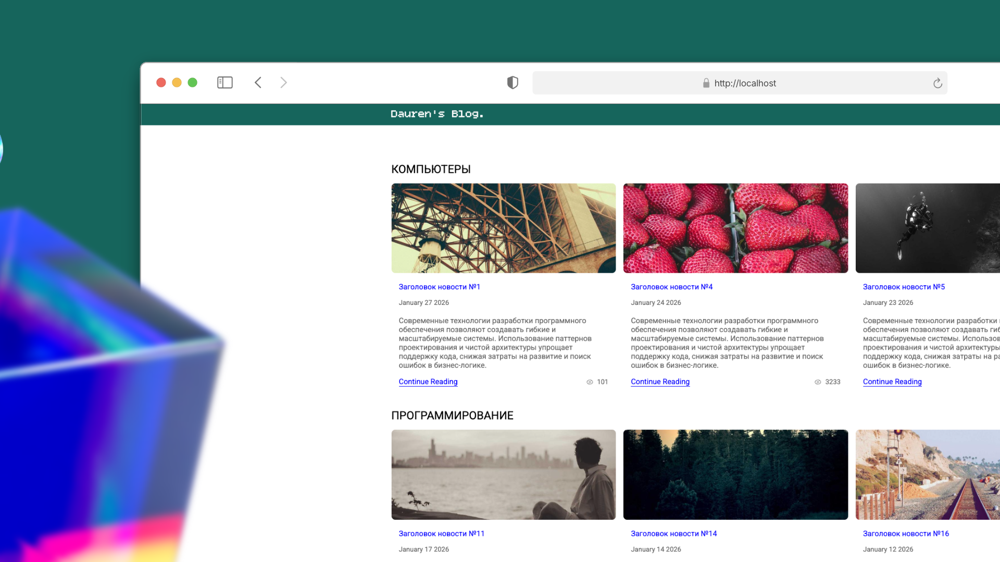

# Статьи без фреймворков



## Requirements

- PHP 8.1+
- npm

## Tech Stack

- Pure PHP
- SCSS

## About

Тестовый проект со статьями. В проекте используется DDD подход. Dependency Injection бинды находятся в `config/dependencies.php`. Проект запускается на `80` порту `http://localhost`

Чтобы запустить сидер используйте команды:

```
// Проект запущен в докере (Фраза дублируется из-за названия контейнера)
docker compose exec php php bin/seed.php

// Если не в докере
php bin/seed.php
```

## Installation

```
git clone https://github.com/daurensky/articles-test.git
composer setup
docker compose up -d
// Если хотим заполнить базу мок данными
docker compose exec php php bin/seed.php
```

## Note

База может подниматься на пару секунд дольше чем php, поэтому выкидывает `Connection Refused`

## Contacts

- [Telegram](https://t.me/daurensky)
- dkambarov17@gmail.com
